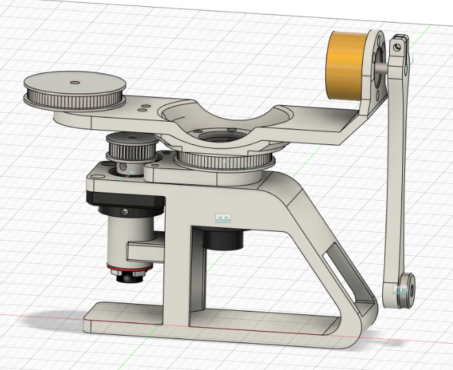
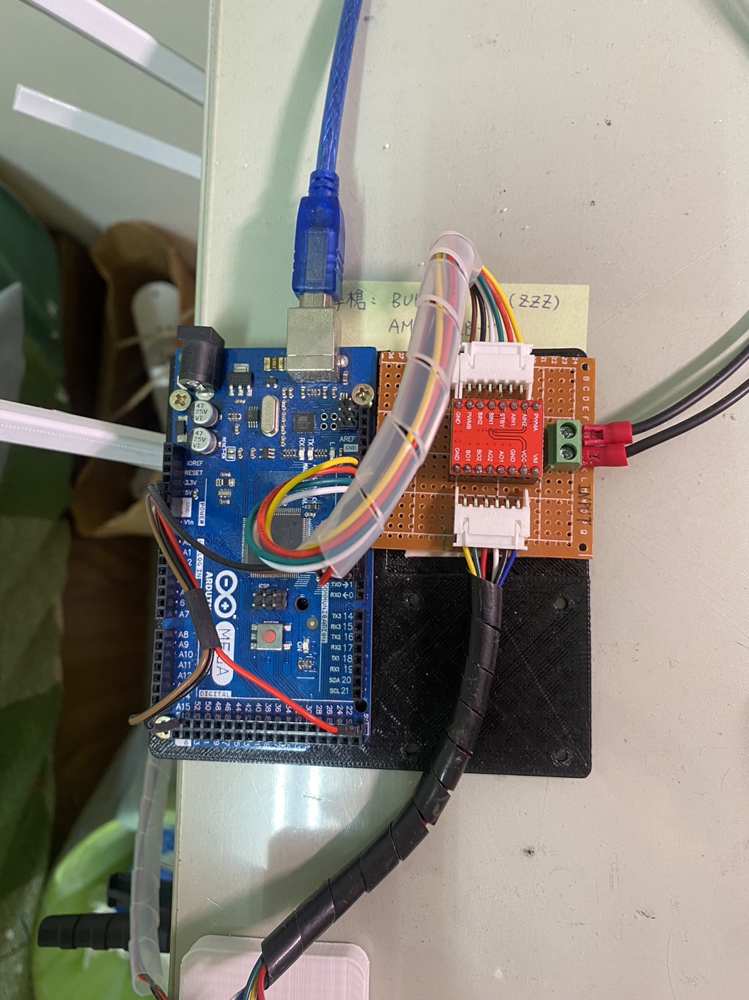

Project_1 旋轉倒單擺
===
內容還需補充
影片: https://youtube.com/shorts/ecyUvNsTMwk

介紹
---
**旋轉倒單擺(Rotary Inverted Pendulum)** 是一個經典的控制問題，結合了旋轉運動和單擺運動，相當於雙級的直線倒單擺。其特點是一個懸掛的棒狀物體，可以在一個固定點進行旋轉運動，同時在這個棒的另一端懸掛一個單擺。這種運動展示了複雜的動力學行為，廣泛應用於物理學教育和研究。

3D 模型建構 & 實際模型搭建
---
### 模型
本人使用 **Fusion360** 進行 3D 模型繪製，如下圖所示:

透過左下方的馬達利用皮帶帶動搖臂進行旋轉，進而帶動右方單擺甩起。在左上方有加了一個和編碼器差不多重量的金屬同步輪作為配重，經過測試證實可以有效降低旋轉時的慣性。

### 電路
==詳細電路圖待補充==

### 組裝
所繪製的模型和其他零件及電路部分皆可在 `Hardware` 中找到，最終組裝後的結果如下:

>自己覺得比較要注意的零件是編碼器和下方的旋轉盤，上方角度建議使用絕對式編碼器，而下方馬達所使用的則是推薦使用增量式編碼器，而下方旋轉盤是為了防止線會捲在一起。

運動學分析
---
我們可透過拉格朗日方程式去進行求解

Matlab 模擬
---
將上述所繪製之3D圖檔轉成 simscape 去進行模擬，詳細步驟可[參考以下影片][1]

[1]:<https://www.youtube.com/watch?v=pDiwAA1cnb0&t=0s>

有了 simscape 讓我們可以很方便的進行控制器的設計。==模擬檔案還要進一步修改==

程式撰寫
---
### 控制器設計

我們將控制器分為平衡控制器、甩上控制器設計，其中平衡控制器採用串級PID進行控制，分為角度環和位置環，而甩上則是透過能量法進行設計。

* 平衡控制器
* 甩上控制器

### 整體架構

參考資料
---
1. 甩上控制 
https://blog.csdn.net/robot1701/article/details/124866352
2. 參數調整 
https://blog.csdn.net/a568713197/article/details/91600285 https://blog.csdn.net/small_po_kid/article/details/107659413
3. PID 程式撰寫
https://github.com/ToanTech/DengFOC_Lib/blob/main/DengFOC%20%E5%BA%93/V0.2/DengFOC.cpp
4. TB6612 直流馬達控制板
https://swf.com.tw/?p=1066
5. 倒立擺控制論文
Nath, K., & Dewan, L. (2018, March). Heuristic optimization based choice of LQR weighting matrices for a rotary inverted pendulum. In 2018 International Conference on Recent Trends in Electrical, Control and Communication (RTECC) (pp. 269-274). IEEE.
